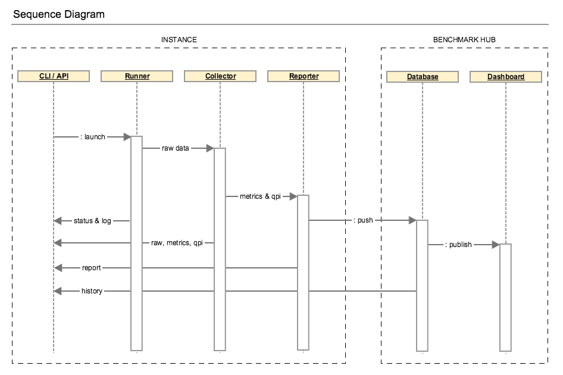
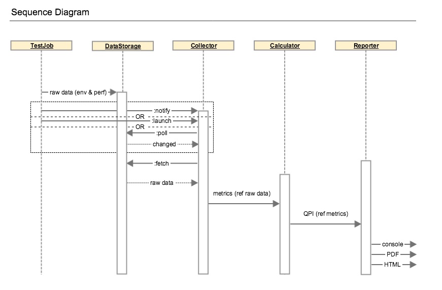

.. This work is licensed under a Creative Commons Attribution 4.0 International License.
.. http://creativecommons.org/licenses/by/4.0
.. (c) 2017 ZTE Corp.

************
Architecture
************

In Danube, QTIP releases its standalone mode, which is also know as ``solo``:

The runner could be launched from CLI (command line interpreter) or API
(application programming interface) and drives the testing jobs. The generated
data including raw performance data and testing environment are fed to collector.
Performance metrics will be parsed from the raw data and used for QPI calculation.
Then the benchmark report is rendered with the benchmarking results.

The execution can be detailed in the diagram below:

